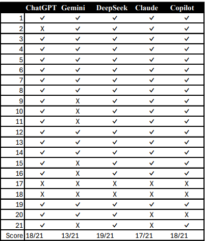

# ChatbotsCodingPerformance
# EVALUATION AND COMPARISON OF AI CHATBOTS' CODING PERFORMANCE: HOW GOOD ARE CHATBOTS TO CODE ON TASKS FROM EASY TO COMPLEX?

This is a study of comparison and evaluation of AI chatbots' coding performance. It emerged as a midterm project of "Fundamentals of Artifical Intelligence" course at Institue of Informatics, Hacettepe University.
# Introduction

I focused to compare and evaluate the coding performance of AI chatbots. There are 5 chatbots to test their performances: ChatGPT, DeepSeek, Claude, Gemini. GitHub Copilot. I entered the prompts in English.

# Chatbots
I used five different AI chatbots:
1. ChatGPT Plus GPT-4o
2. Gemini Advanced 2.0 Flash
3. DeepSeek-V3
4. Claude 3.7 Sonnet Pro Plan
5. GitHub Copilot GPT-4.1 Pro

# Queries
I wanted chatbots to generate 21 different mathematical calculation codes in Python. Here are queries:
1. Calculation the determinant of 7x7 matrix
2. Calculation the determinant of 11x11 matrix
3. Matrix product for 7x7 matrices
4. Matrix product for 15x15 matrices
5. Matrix product for 20x20 matrices
6. Matrix product for 6x4 and 4x8 matrices
7. Matrix product for 12x4 and 4x16 matrices
8. Matrix prodcut for 5x10 and 20x4 matrices
9. Calculation the transpose of a matrix
10. Calculation the complex conjugate of a matrix
11. Calculation the hermitian conjugate of a matrix
12. Calculation the inverse of a square matrix
13. Checking whether a square matrix is symmetric and antisymmetric
14. Checking whether a square matrix is hermitian and anti-hermitian
15. Checking whether a square matrix is orthogonal or not
16. Checking whether a square matrix is unitary or not
17. Calculation eigenvalues and eigenvectors of a 3x3 matrix
18. Calculation eigenvalues and eigenvectors of a 7x7 matrix
19. Solving 2nd order differential equation with Runge-Kutta method
20. Solving 2nd order differential equation with Adams-Bashforth-Moulton method
21. Solving 2nd order differential equation with Milne method

# Prompts
You can find the prompts I entered to the chatbots in `prompts.txt` file.

I did not send separate prompts for every single query. Instead, I merged same calculations into one prompt. Here is the first prompt I entered for the first two queries:

<i>Write a Python code that calculates the determinant of given matrix in size 7x7 and 11x11. Write separate functions for both 7x7 and 11x11.</i>

# Evaluation
There are two conditions that the generated codes must meet:
1. The code must run without any sytnax error.
2. The code must give the correct answer.

If a generated code meet these conditions, it is accepted that the chatbot answered the query correctly.

# Results

You can find the results query by query on the table below.

Here is the score table:

1. DeepSeek-V (19/21) ---> % 90.48
2. ChatGPT Plus GPT-4o & GitHub Copilot GPT-4.1 Pro (18/21) ---> % 85.71
3. Claude 3.7 Sonnet Pro Plan (17/21) ---> % 80.95
4. Gemini Advanced 2.0 Flash (13/21) ---> % 61.9